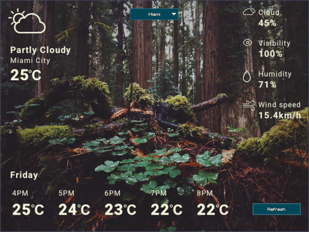

# Little Weather App 🌦️

Minimal viable weather app built with **C++** and **Raylib**.
✅ Core functionality is implemented.

🔧 Next steps:

- 📍 Load cities from a config file
- 🐞 Bug fixes
- 🧪 Testing
